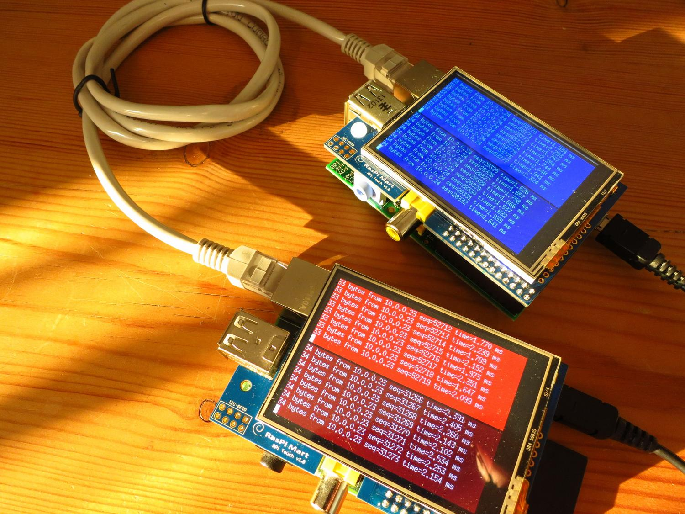

# stping/dgping: TCP and UDP ping

**dgping** and **stping** provide a ping-like client and server
for `SOCK_DGRAM` (UDP)
and `SOCK_STREAM` (TCP).

Run either daemon to listen for packets on a particular port:

    ; ./dgpingd 127.0.0.1 2108
    listening on 127.0.0.1:2108 UDP/IP

And run the client like you would for ICMP ping, to the same port:

    ; ./dgping -c 3 127.0.0.1 2108
    34 bytes from 127.0.0.1 seq=0 time=0.606 ms
    34 bytes from 127.0.0.1 seq=1 time=0.218 ms
    34 bytes from 127.0.0.1 seq=2 time=0.349 ms
    
    - DGRAM Ping Statistics -
    3 transmitted, 3 received, 0 timed out, 0 disregarded, 0.0% packet loss
    round-trip min/avg/max/stddev = 0.218/0.391/0.606/0.197 ms

The clients respond to SIGINFO if your OS provides that (Linux doesn't),
giving the current status:

    4/4 packets, 0 timed out, 0 disregarded, 0.0% loss, min/avg/max/stddev = 0.055/0.061/0.077/0.011 ms

## What would I use it for?

I don't know. I hope you like it.

## Installing

Clone with submodules (contains required .mk files):

    ; git clone --recursive https://github.com/katef/stping.git

To build and install:

    ; pmake -r install

You can override a few things:

    ; CC=clang PREFIX=$HOME pmake -r install

Building depends on:

 * Any BSD make. This includes OpenBSD, FreeBSD and NetBSD make(1)
   and sjg's portable bmake (also packaged as pmake).

 * A C compiler. Any should do, but GCC and clang are best supported.

 * ar, ld, and a bunch of other stuff you probably already have.

Ideas, comments or bugs: kate@elide.org

